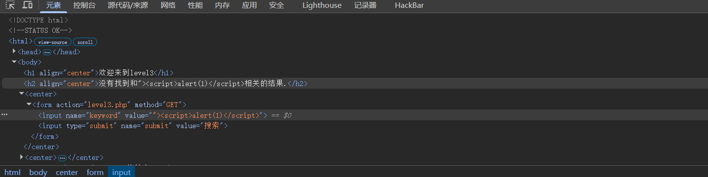
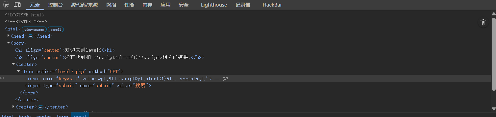
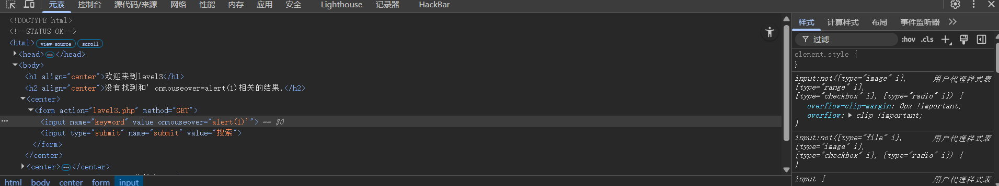

# level-3

本关先尝试上一关的payload

接着再尝试用单引号闭合尝试

发现尖括号被html实体编码了，于是排除有尖括号的payload。

换一种不需要尖括号的思路，通过单引号闭合之后，我们可以自己构造一个属性，比如onclick，onmouseover之类的事件监听器

之后发现属性构造成功，但单引号妨碍了脚本的执行，我们需再放入一个单引号闭合则能成功弹窗

payload:' onmouseover='alert(1)

‍

‍
