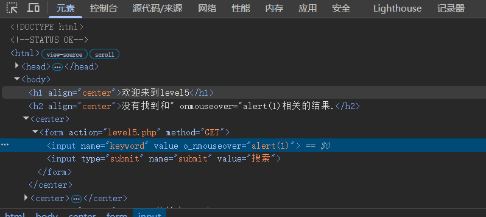
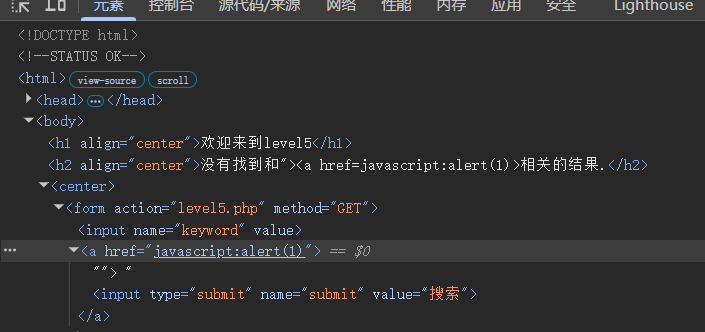

# level-5

尝试上一关的思路，反馈如下

并且script同样也被过滤，这时候可以祭出强大的javascript伪协议绕过，但前提是要在a标签中的href中执行，但思路已经很明确了:闭合前面的input标签，另起炉灶a标签

payload:"\>\<a href\=javascript:alert(1)\>

注:最后不需要手动闭合a标签，否则脚本无法在页面中触发，上述payload浏览器会自动闭合

如上，浏览器将input搜索按钮包含在a标签内，从而使脚本有媒介点击触发

