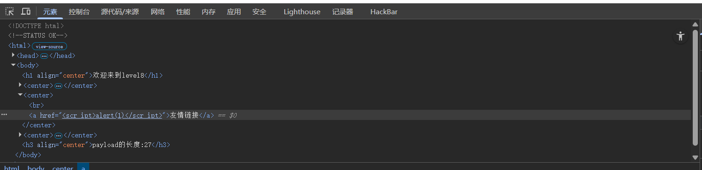
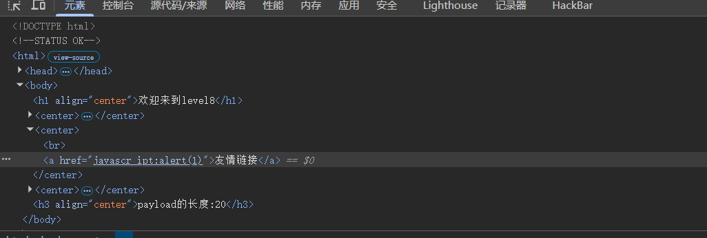
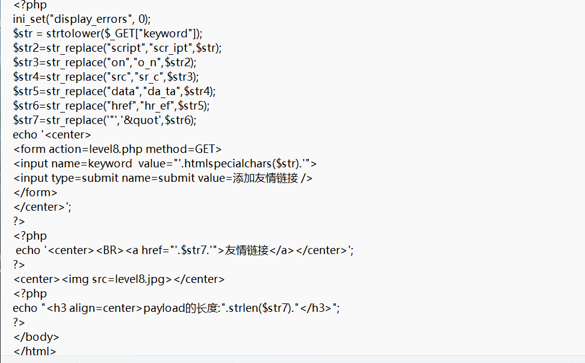

# level-8

这一关相较于前几关有所不同，关键是点击友情链接触发XSS漏洞，页面源码如下

发现友情链接处是由a标签和href属性构成，而我们输入的内容会被传入href属性用于链接跳转，这时应该能想到用javascript伪协议进行操作

但由于后端的过滤规则行不通，但有经验的hacker会不自觉的想到编码的方法，我们查看一下后端的源码验证一下猜想

果然，后端没有对编码规则进行过滤。对javascript:alert(1)进行html实体编码即可成功绕过

‍

payload:\&\#106;\&\#97;\&\#118;\&\#97;\&\#115;\&\#99;\&\#114;\&\#105;\&\#112;\&\#116;\&\#58;\&\#97;\&\#108;\&\#101;\&\#114;\&\#116;\&\#40;\&\#49;\&\#41;

‍
