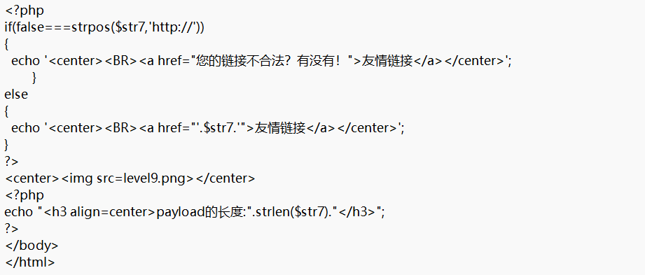

# level-9

这一关对于链接的协议头进行了限制，从提示内容可以看出来，再看看后端源码

所以payload中要想办法塞入http://协议头,可以用注释把这个协议头注释掉，只执行前面的攻击代码

剩下的就和第九关没区别了

‍

payload: \&\#106;\&\#97;\&\#118;\&\#97;\&\#115;\&\#99;\&\#114;\&\#105;\&\#112;\&\#116;\&\#58;\&\#97;\&\#108;\&\#101;\&\#114;\&\#116;\&\#40;\&\#49;\&\#41;\&\#47;\&\#47;http://

注:为什么协议头不需要编码呢?

这里需要明确用户传入的数据流是如何被解析的(解析顺序):

当用户传入数据后，数据首先被传入后端校验，而如果这里对协议头进行html实体编码，后端的编译器(java/python/php)是不认识html实体编码的，所以还是会被视为非法链接。后端校验完后传回前端，更新DOM树结构，浏览器重新渲染，而浏览器是认识html实体编码的，所以注释符号浏览器可以看懂，前面的攻击代码可以成功执行。

‍
