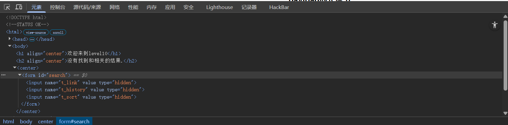
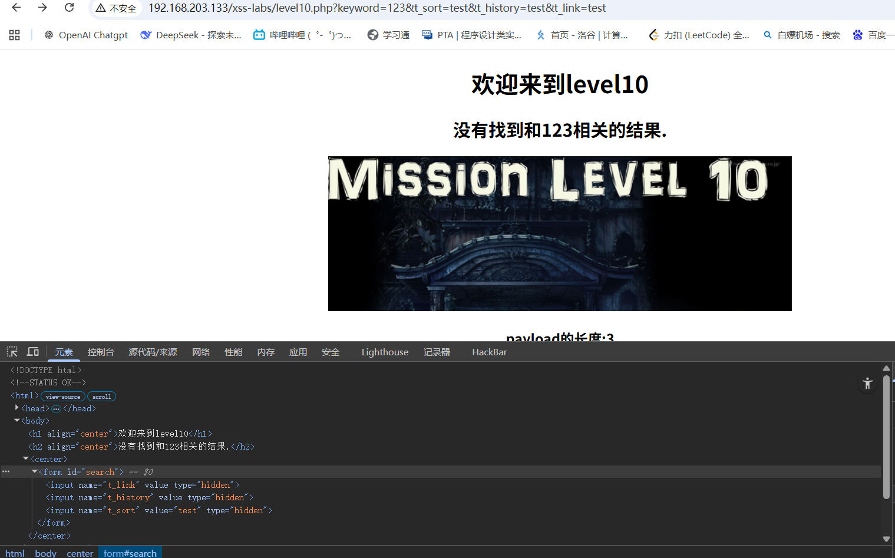

# level-10

这一关没有任何可以与用户交互的按钮，但看向URL发现有参数传向后端，再查看一下页面源码

发现存在input标签，但被隐藏起来了，这通常是开发者用作其他用途的，比如进入这个网页的用户是从不同入口进入的，而从商业角度必须区分这些入口，因此在用户访问该网页或交互时，浏览器就会把这些隐藏信息作为参数传递到后端记录下来，而后端对传入的参数如果没有进行严格过滤的话，这些隐藏参数就会被攻击者控制

因此，我们需要测试哪些标签可以作为URL参数传入后端

URL中对三个参数都做出了测试，只有名为 t_sort 的属性做出了回应，那么我们可以用之前的思路对其注入,并且要有触发点，必须把type属性值设置为test

‍

payload:123&t_sort=" type="text" onmouseover="alert(1)

‍
