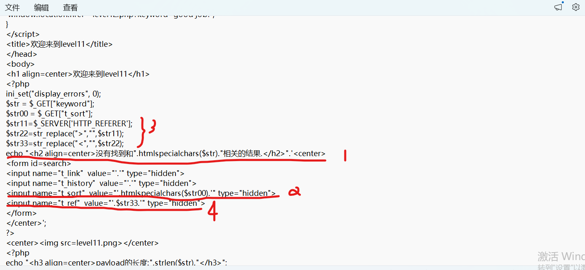

# level-11

上一关的老套路已经行不通了，我们审计一下源码

红线1和红线2对我们传入的keyword参数和t_sort标签的相关参数都做了htmlspecialchars函数过滤，意味着上一关的思路行不通了，但是数字3处对referer请求头的参数做了提取，且没做任何过滤，红线4处直接将参数插入了input标签，给了我们可乘之机。

对于referer参数，是标记我们从哪里进入的这个网页，如果直接在url栏输入该页面网址访问则不会有这个参数，因为我们是从level10跳转过来的，所以存在referer参数,修改referer参数可以通过Burp抓包

或者Hackbar的post模式

‍

payload:" type="text" onmouseover="alert(1)
