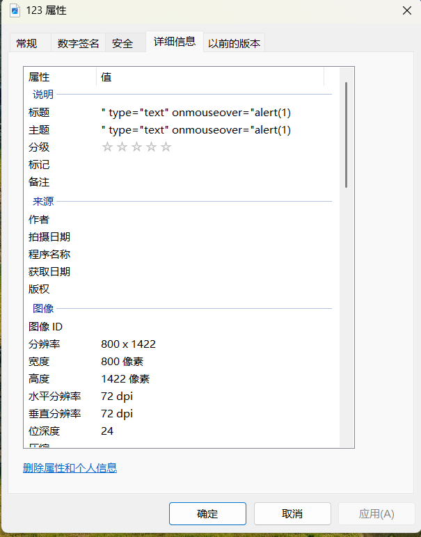

# level-14

这一关由于之前作者写的源码引用的地址失效了，所以我仿照前面关卡的源码风格用Gemini生成了源码

<!DOCTYPE html><!--STATUS OK--><html>  
<head>  
<meta http-equiv="content-type" content="text/html;charset=utf-8">  
  
<title>欢迎来到level14</title>  
</head>  
<body>  
<h1 align=center>欢迎来到level14</h1>

<?php  
ini_set("display_errors", 0);

// 获取 keyword 参数并过滤，用于显示在页面上  
​$str =$_GET["keyword"];

// 模拟文件上传逻辑  
if (isset($_FILES['file'])) {  
    $upload_dir = 'uploads/';  
    if (!is_dir($upload_dir)) mkdir($upload_dir);  
    $target_file =$upload_dir . basename($_FILES["file"]["name"]);

    if (move_uploaded_file($_FILES["file"]["tmp_name"],$target_file)) {  
        // 读取 Exif 信息  
        $exif = exif_read_data($target_file);  
        // 获取“图像描述”字段 (ImageDescription)  
        $str11 =$exif['ImageDescription'];

        // 按照 xss-labs 的套路：过滤掉尖括号，迫使你使用属性注入（如 onmouseover）  
        $str22 = str_replace(">","",$str11);  
        $str33 = str_replace("<","",$str22);  
    }  
} else {  
    $str33 = "no exif data";  
}

echo "<h2 align=center>没有找到和".htmlspecialchars($str)."相关的结果.</h2>".'
  
<form action="" method="post" enctype="multipart/form-data">  
    <input type="file" name="file">  
    <input type="submit" value="上传图片查看详细信息">  
</form>

<form id=search>  
<input name="t_link"  value="" type="hidden">  
<input name="t_history"  value="" type="hidden">  
<!-- 注入点：这里的 value 拿到了 Exif 信息 -->  
<input name="t_exif"  value="'.$str33.'" type="hidden">  
</form>  

';  
?>

< img src="level14.png">

<?php   
echo "<h3 align=center>payload的长度:".strlen($str33)."</h3>";  
?>  
</body>  
</html>

‍

从源码中不难发现，后端对上传图片的exif属性没有进行严格的检查，通过修改图片属性中例如标题字段可实现XSS攻击

‍

payload:" type="text" onmouseover="alert(1)

‍
