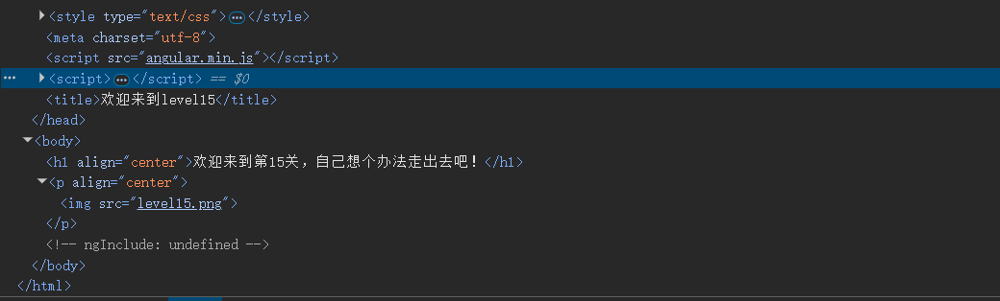
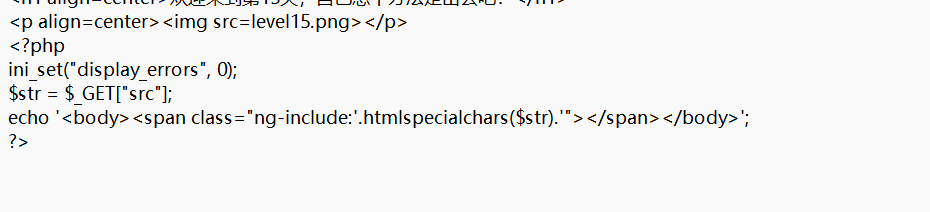

# level-15

不着急审计源码，先从网页源码中寻找思路

从源码中发现，多了两处前面关卡都没有的点，AngularJS前端框架和其属性ngInclude，提示已经相当到位了，在AngularJS前端框架中，ngInclude属性可以引用外部传来的html属性，且默认只能加载与当前页面同源(相同域名、端口号)的文件，所以我们可以选择第一关的参数进行包含，因为第一关的参数没有过滤。

通过源码发现可以通过src参数像后端传递数据，注意一点，这个参数必须用单引号包裹，否则ngInclude会把参数值识别为变量而不是字符串。

原理：当框架加载第一关的内容时会直接渲染到第十五关，所以第一关的恶意脚本会在第十五关被执行，直接绕过了第十五关的htmlspecialchars过滤

‍

payload:?src='level1.php?name='
