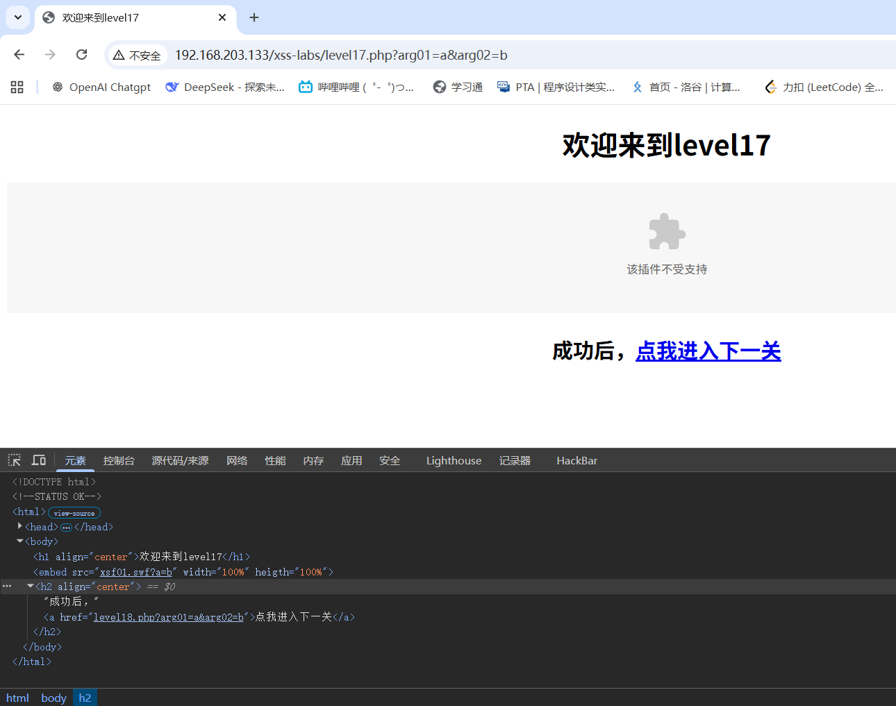

# level-17

这一关开始，flash插件与html标签属性结合

观察URL栏和网页源码

随后尝试改变arg02参数值，尝试逃出src的控制范围，发现可行，空格和%0a均可,z再用鼠标事件触发弹窗绕过即可

‍

payload:%0aonmouseover=alert(1)

‍

由于flash插件限制，具体实现效果可以参考b站up主: 天欣skyx

入口:

https://www.bilibili.com/video/BV1vQ2WYEEhV?spm_id_from=333.788.videopod.sections&vd_source=8fd3cfadf8ad0535f1d1f57b332c030d&p=17
