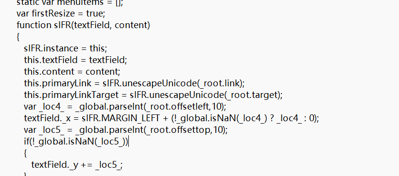
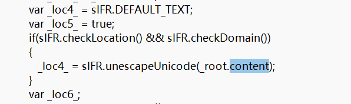
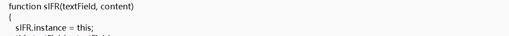
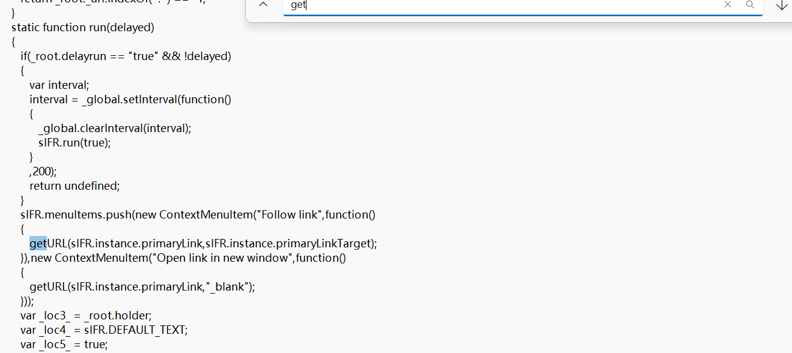

# level-19

这一关的漏洞本质其实是是一个ActionScript XSS，也叫Flash XSS。虽然flash早在几年前就停止维护，但这一关还是很有学习意义的，核心在于反编译swf文件+代码审计

第十九关和前两关的绕过手法不同，单纯的在网页测试无法绕过，真正的漏洞出现在swf文件中

准备工具:JPEXS Free Flash Decompiler

将swf拖入反编译工具中，查看源码

通关原理和漏洞点:

在ActionScript中，_root.变量名是从URL参数传到Flash的参数

在这个源码文件中，_root.link接收参数后存入this.primaryLink,_root.target存入this.primaryLinkTarget，

root.content经过上述函数后存入_loc4_中

这一段代码，将之前的变量都存在了instance中，用户的不安全输入也在其中

而getURL是Flash中常用的一个跳转函数

如果URL栏中的参数是用户可控的，我们可以通过参数传入javascript伪协议，该函数会识别js代码并执行

最后还需要让flash执行这个getURL函数，源码中这个函数在push菜单下的Follow Link选项，注入后点击这个选项可触发

总的来说，出现这种漏洞的原因还是对用户的输入没有进行严格的检查和过滤

‍

payload:?arg01=javascript:alert(1)&arg02=_self

补充知识点:

在HTML和Flash里有如下常用的关键字:

_self：在当前窗口打开，默认值

_blank：在新标签页打开

特地传入self只是为了欺骗浏览器，防止拦截弹窗

‍

由于flash插件限制，具体实现效果可以参考b站up主: 天欣skyx

入口:

https://www.bilibili.com/video/BV1vQ2WYEEhV?spm_id_from=333.788.videopod.sections&vd_source=8fd3cfadf8ad0535f1d1f57b332c030d&p=19
