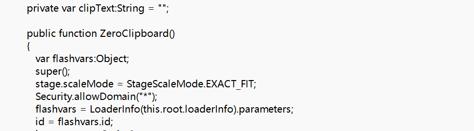
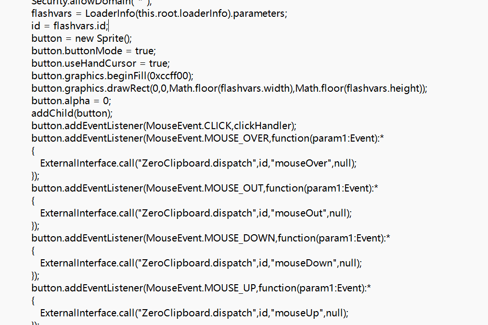

# level-20

最后一关我们再来看反编译后的源码

这里有一个关键的Flash对象flashvar，用来接收从HTML页面传入的参数，相当于php的$_GET

另一个关键点是Externalinterface函数，用于执行前端的JS函数，上面的代码意思就是ZeroClipboard.dispatch和传进来的参数id拼接，最后到前端执行

这么做的结果就是提前闭合参数，直接到前端被调用执行，而id没有进行任何的过滤。

‍

payload:?arg01=id&arg02=xss\\\"))}catch(e){alert(/xss/)}//%26width=123%26height=123

这一关仅作为了解

由于flash插件限制，具体实现效果可以参考b站up主: 天欣skyx

入口:

https://www.bilibili.com/video/BV1vQ2WYEEhV?spm_id_from=333.788.videopod.sections&vd_source=8fd3cfadf8ad0535f1d1f57b332c030d&p=20

‍
